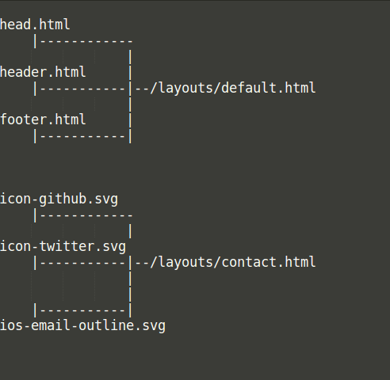

<h2>Documentation of the website CASES</h2>

This is the new website of the company CASES.


<h2>Languages</h2>

This website is developed in HTML/CSS, Markdown, Liquid, with the framework Jekyll and Bootstrap 3.3.7, and Javascript.

To install Jekyll, please visit this page https://jekyllrb.com/docs/installation 

To see more about Liquid : https://shopify.github.io/liquid

To see more about Markdown https://blog.ghost.org/markdown/

And finally to know more about Bootstrap https://getbootstrap.com/docs/3.3/


<h2>Summary</h2>

Step by step, we'll see the different folders, how this website works, where we need to go to update the content, etc.

1. [Layouts](#layouts)

2. [Includes](#includes)

3. [Stylesheet](#stylesheet)

4. [Content](#content)

5. [Ressources](#ressources)

6. [Update](#update)

<h3 id="layouts">Layouts</h3>

Folder : /layouts/

 
On the top we have "default", then every layouts add something to "default", in order to complete their design.

This is the arborescence of the layouts.

```
default
|
|------contact
|
|------home         
|                   
|------knowhow      
|                    
|------article                         
|                                                                          
|------legal
|
|------publication-list
|
|------page
|
|------post
|
|------/publication-list/index
```

<h4>Default</h4>

The main design is the page "**default**".

On this page, we have imports (The compiled and minified javascript) :

* /assets/jquery-1.12.4.min.js

* /assets/bootstrap.min.js

* jquery.touchSwipe.min.js

Under the imports, there is a **script** for the carousel on the homepage. Without this script, it won't swipe to the 

left or to the right.    

On this page, we have to include some other pages, "**head.html**", **header.html**" and "**footer.html**". 

On the page "head.html" there are a few imports :

* bootstrap.min.css

* bootstrap-theme.min.css

* jquery.touchSwipe.min.js


<h4>Home</h4>

This layout is for the page "**Home**". This page displays a carousel, the list of the different categories, as 

Articles, Publications, Knowhow, and on the right we have a Twitter plugin. 

<h4>Page</h4>

This layout is for the page "**Services**". This page displays the different services of CASES.

On the left, we have a **Table of Content** (**TOC**) composed by a few buttons. These buttons are on the this layout.

We loop through the folder "services" and link the buttons to the correct pages. 

On the right, we have another TOC, with all the titles and subtitles.


<h4>Knowhow</h4>

This layout is for the page "**Knowhow**".This page displays the knowhow of the company through a few articles.

Since there are articles once again, this page is also composed by a TOC on the left and on the right.

For the left TOC, if we want to add another category or page, we have nothing to change in the file "knowhow.html" 

because the file's addition is dynamic. 

There is also a script which change the bullet of the article's list when we open a category.


<h4>Post & index</h4>

These layouts are for the page "**Articles**".

The first one displays a complete article, the second one displays 4 articles with an extract under them (folder: /

articles-list/index). 
 
On the left we have a TOC with a list of all articles, from the most recent to the oldest. 

On the right, we have a TOC with the titles and subtitles. 

Besides, to see all articles, the framwework has a feature, a pagination. We display 4 articles per page.


<h4>Publication-list</h4>

This layout is for the page "**Publications**". 

On the left we have a TOC with a list of all publications, they are sorted by categories. 

On the right, we have a TOC with the titles and subtitles. 

If we want to add a new category, we need to add a "tag" to "**list-cat**" and it's name to "**list-name**".

On this page there is also a script which change the bullet of the publication's list when we open a category.


<h4>Legal</h4>

This layout displays just a few lines about legal information, the protection of personal data and the law.


<h4>Contact</h4>

This layout is for the page "**Contact**".

It displays a Google Maps widget with the company's address and some information as Twitter or GitHub. 


<h3>Includes</h3>

Folder : /includes/

In this folder, we have all the pages which are included in the page "**default**" and "**contact**".

This is the arborescence of the "include" pages and how they work.



<h4>Header</h4>

On this page we have the menu's layout, with all categories.

If we want to change a color or a design, it's on this page.

<h4>Head</h4>

On this page, we have **javascript** inclusions:

* /assets/bootstrap.min.css

* /assets/bootstrap-theme.min.css

Then, there is the **stylesheet**: 

* assets/styles.css

Finally, the **favicon** of the website :

* assets/img/favicon.png


<h4>Footer</h4>

On this page we have all **links** as "About us", "Legal" or the services inside "SecurityMadeInLu".

Besides, this is the design of the footer.


<h3 id="stylesheet">Stylesheet</h3>

Folder: /assets/style.css

On this page there are all classes, we rewrote some classes from Bootstrap.


<h3 id="content">Content</h3>

The content pages are written in **Markdown**.

<h4>Services</h4>

Folder: /services/

Subfolder: /services/trainings

These folders present all company's services. 


<h4>Knowhow</h4>

Folder: /knowhow/

Subfolders: 

* /knowhow/bestpractices/

* /knowhow/cisoapproach/

* /knowhow/sos/

* /knowhow/glossary/

These subfolders present the company's knowhow, the last one is a glossary of all technical words.


<h4>Publications</h4>

Folder: /publications/

Subfolders:

* /publications/bestpractices

* /publications/cleverclicks/

* /publications/ISO27000SF

* /publications/recommendationsecuring/

These subfolders present all company/s publications. 


<h4>Articles</h4>

Folder: /posts/  and  /articles-list/index.html

This folder present all articles and th second one displays 4 article


<h4>Media</h4>

Folder: /downloads

This page present some files which are downloable. 


<h4>Legal</h4>

Folder: /legal

This page present legal information.


<h4>Contact</h4>

Folder: /contact

This page present contact information.


<h3 id="ressources">Ressources</h3>

Folder: /assets/

This folder contains some ressources which are necessary for the website.

<h4>Documents</h4>

Subfolder: /assets/files

There are 2 PDF files.


<h4>Glyphicon for carousel</h4>

Subfolder: /assets/fonts

In this subfolder there are glyphicons for the Bootstrap's carousel.


<h4>Images</h4>

Subfolder:

* /assets/img :
		
	* /201507

	* /201610

	* /services

	In this folder we have all pictures for services. 

At the root, there are all scripts from Bootstrap and JQuery.


<h3 id="update">Update</h3>


<h4>Articles & Services</h4>

If we want to add new articles or new services, we just have to add the page in the right folder, nothing else.

To change the number of articles which are displayed, we need to go to "**/config.yml**" and change "**paginate**".

We can change the **url** of articles with "**paginate_path**".

<h4>Knowhow</h4>

If we want to add a new category, we have to add this new page ,with the right title, in the folder. 

In the same way, we can add a new page.


<h4>Publications</h4>

If we want to add a new category, we have to add the new name in "**list-name**".

Then, we add a tag-name to the new page from the new category. This tag must be added to "**list-cat**". 


<h4>Bootstrap</h4>

Download the version 3.3.7.x from https://getbootstrap.com/docs/3.3/getting-started/#download

Put all the files in the folder "**/assets**", except Fonts, they'll go to the root

Put the file in the folder "/assets" with the right name

Change paths from :

* /includes/head.html :
	
	* bootstrap.min.css

	* bootstrap-theme.min.css

* /layout/default.html :

	* jquery-1.12.4.min.js

	* bootstrap.min.js

	* jquery.touchSwipe.min.js

